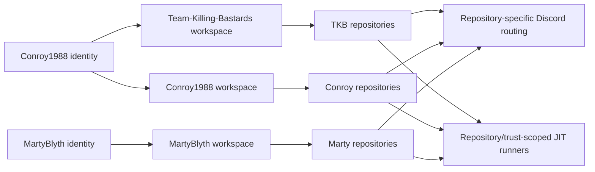

 

### Scottish roots. Community first. Build it properly. Operate it seriously.

**Gaming community · Public game tooling · Private operational platforms · Research systems · Knowledge platforms · Home infrastructure · Secure automation**

[**Community**](#the-community) · [**Leadership**](#community-leadership) · [**Systems**](#organisation-systems) · [**Member portfolios**](#member-portfolios) · [**GitHub Hub**](#github-integration-model) · [**Operations**](#live-operations-board) · [**Repositories**](#repository-index)

---

# The Community

**Team Killing Bastards — TKB — is a Scottish-run gaming community and technical project home.**

The community was founded and originally created by **[Conroy1988](https://github.com/Conroy1988)**. It is led by Conroy alongside **[MartyBlyth](https://github.com/Martyblyth)**, his right-hand and fellow community leader.

TKB hosts public MissionChief tooling, private Discord infrastructure, household operations software, market-intelligence research, portfolio governance, and shared delivery systems. Its members also maintain public knowledge, research, and game projects in their own GitHub namespaces.

Organisation hosting does **not** merge product ownership. Each maintained system retains its own creator, technical authority, canonical source, credentials, data boundary, release path, deployment authority, and recovery responsibility.

<table>
<tr>
<td width="25%" align="center"><strong>🏴 SCOTTISH-RUN</strong> Long-term community identity and leadership.</td>
<td width="25%" align="center"><strong>⚙️ FOUR ORG SYSTEMS</strong> Public products and private operational platforms.</td>
<td width="25%" align="center"><strong>🛡️ CONTROLLED</strong> Trust boundaries proportionate to real exposure.</td>
<td width="25%" align="center"><strong>◈ MEMBER-LED</strong> Conroy and Marty retain authority over their systems.</td>
</tr>
</table>

## Operating principles

| Principle | Meaning inside TKB |
|---|---|
| **Community before tooling** | Technology exists to support genuine community, gameplay, administration, research, or household operations |
| **Explicit technical authority** | Every maintained system has a named owner and release authority |
| **Separate trust domains** | Discord, userscripts, home systems, finance research, games, and knowledge platforms do not share credentials or runtime control |
| **Evidence over assumption** | Releases, deployments, backups, migrations, research claims, and recovery are verified against resulting state |
| **Maintenance is product work** | Documentation, issues, security, compatibility, validation, and recovery are part of delivery |

---

# Community Leadership

<table>
<tr>
<td width="50%" valign="top">

## [Conroy1988](https://github.com/Conroy1988)

**Founder · Original owner · Community leader**

Conroy created Team Killing Bastards and retains founder responsibility for its identity, direction, governance, and long-term stewardship.

**Technical authority**

- Sole developer and operational owner of **TKB Discord Bot**
- Project lead and Admin authority for **Investor Matrix**
- Creator and release authority for **MissionChief Map Command Toolkit**
- Creator and knowledge owner of **MissionChief UK**
- Creator and research owner of **GitHub Achievement Encyclopedia**
- Creator and architecture owner of **UK Fire Command**
- Organisation governance, repository infrastructure, release engineering, and delivery support
- Designer and implementer of the scoped **Command Nexus v1.0.15–v1.0.16 iOS Safari compatibility work**, initiated by Conroy and contributed with Marty's permission

</td>
<td width="50%" valign="top">

## [MartyBlyth](https://github.com/Martyblyth)

**Community leader · Conroy's right-hand · Project owner**

Marty leads alongside Conroy as his principal leadership partner and right-hand within the community.

**Technical authority**

- Creator, principal userscript author, technical owner, and release authority for **MissionChief Command Nexus**
- Creator, owner, and primary developer of **Blyth Control Centre**
- Development direction and production approval for his systems
- Community leadership and operational support

</td>
</tr>
</table>

> **Community leadership is shared. Technical ownership remains explicit.** Scoped contributions are credited without transferring creator or release authority.

---

# Organisation Systems

## MissionChief Command Nexus

### Unified MissionChief UK resource preparation and dispatch

**Current production version: `1.0.16` · Mission Finder engine: `V10.6.80`**

Command Nexus combines Marty's Mission Finder and Unit, Station & Personnel systems into one maintained userscript.

**Current capability**

- Station and vehicle naming
- Preview and Live personnel assignment
- Read-only vehicle/personnel training-register construction
- Complete vehicle-list loading
- Live Mission Requirements as current selection authority
- Still Needed / Required reconciliation
- Exact trained specialist-vehicle matching
- Unit Finder, Mission Update, upgrades, Auto Mode, and continuation
- Verified release, Greasy Fork parity, checksums, and Discord publication
- iPhone and iPad Safari support for the shared Unit, Station and Personnel menu
- Responsive station discovery and managed same-origin iframe fallback
- Continuous single-menu enforcement after duplicate injection, page replacement, or Safari bfcache restoration
- Safe-area positioning, visual-viewport clamping, rotation recovery, and touch/pointer dragging

**Ownership:** Created and technically owned by [MartyBlyth](https://github.com/Martyblyth). The iOS Safari compatibility work was initiated, designed, and implemented by [Conroy1988](https://github.com/Conroy1988) after Marty granted permission to contribute. Version 1.0.16 hardens the station workflows and duplicate-menu boundary established in v1.0.15.

[Install](https://greasyfork.org/en/scripts/587702-missionchief-command-nexus) · [Repository](https://github.com/Team-Killing-Bastards/MissionChief-Command-Nexus) · [Changelog](https://github.com/Team-Killing-Bastards/MissionChief-Command-Nexus/blob/main/CHANGELOG.md)

## TKB Discord Bot

### Private Discord, GitHub, progression, deployment, and gateway operations platform

The TKB Discord Bot is the operational backbone of the community and development environment.

**Current capability**

- Discord commands, events, scheduling, starboard, Battlefield, AI, Giphy, and community automation
- **Levels 2.1** daily/weekly challenges, forgiving streaks, seasons, squads, campaigns, badges, special titles, and rich profiles
- Moderation logging and immutable case management
- FastAPI **Control Centre 2.0**
- Transactional SQLite state and encrypted credentials
- Managed Caddy HTTPS Gateway with validation, adoption, rollback, reconcile, and abandon workflows
- Backup, update, restore, rollback, and restricted host-agent evidence
- Multi-owner **GitHub Integration Hub**
- GitHub App repository discovery and signed webhooks
- Repository-specific Discord routing with retries and dead letters
- Isolated Linux/Windows repository-scoped JIT runners and workflow evidence
- Controlled retry/reconcile operations and audited production sign-off
- Controlled Windows JIT smoke workflow validating non-admin identity, isolated leases, absent supervisor secrets, and no Docker-daemon access
- Sanitised read-only **Tapo Phase 0** TD21/H200 compatibility probe with no production connector or control capability

**Authority:** Solely developed and operationally owned by [Conroy1988](https://github.com/Conroy1988).

[🔒 Open private repository](https://github.com/Team-Killing-Bastards/TKB-Discord-Bot)

## Blyth Control Centre

### Private household technology, heating, and energy command surface

**Current version: `0.5.6`**

Blyth Control Centre consolidates the Blyth household estate into one responsive command interface.

**Implemented capability**

- Home Assistant and Synology NAS telemetry
- Same-origin, allowlisted Home Assistant control actions
- Dedicated furnished downstairs and upstairs SVG reference floorplans displayed together
- Live Hive and Kasa-derived room overlays positioned over the correct rooms
- Energy and Hive temperature views on stable reference geometry
- Main `climate.heating` whole-home thermostat mapping
- Confirmed `climate.front_living_room` and `climate.the_cave` room mappings
- Betty Bedroom and Hall retained as pending zones; Bathroom retained as unavailable while its entity is offline
- Current power, daily/monthly energy and cost, trends, room/device allocation, heating state, and temperature targets
- Emby runtime and activity context
- Radarr and Sonarr API integration
- NZBGet JSON-RPC queue and history presentation
- External identity/access protection, sanitised service links, account profile, and explicit logout
- Hardened Synology Docker deployment and GHCR publication

**Ownership:** Created, owned, and primarily developed by [MartyBlyth](https://github.com/Martyblyth).

[🔒 Open private repository](https://github.com/Team-Killing-Bastards/blyth-control-centre)

## Investor Matrix

### Private market-intelligence and risk-control platform

**Current state: Phase 0 — authenticated, recoverable Docker foundation**

**Implemented capability**

- Next.js command centre and FastAPI API
- PostgreSQL users, sessions, audit events, and Alembic migrations
- Admin and Member account boundaries
- Argon2 authentication, CSRF, throttling, and lockout
- Password changes, active-session control, and audit filters
- Redis and dependency readiness
- Admin-only fast-forward GitHub updater
- PostgreSQL backup, SHA-256 manifests, transactional restore, and recovery drills

Market ingestion, portfolio accounting, risk analytics, backtesting, and explainable signals remain gated behind later phases.

**Authority:** Project lead and Admin authority — [Conroy1988](https://github.com/Conroy1988).

[🔒 Open private repository](https://github.com/Team-Killing-Bastards/Investor-Matrix)

> [!IMPORTANT]
> These four systems are independent products. They do not share runtime, credentials, household data, financial data, deployment authority, or release ownership merely because they are hosted under TKB.

---

# Member Portfolios

## Conroy1988

### MissionChief Map Command Toolkit

**Current verified release: `v4.20.28`**

A public MissionChief map operations suite covering mission intelligence, live requirement reconciliation, specialist fleet identity, geographic coverage, transport workflows, finance, payouts, seven interface systems, and Desktop/Tablet/iOS layouts.

Version 4.20.28 isolates Mission Inspector, Mission Value, Mission Requirements, and Custom Vehicle Badges state routing plus their post-reconciliation effects while preserving presentation and execution order. It retains the v4.20.27 map/visibility extraction, v4.20.26 financial-setting routing, Boot lifecycle contracts, unchanged-render measurement, and Financial Advisor reconciliation.

[Repository](https://github.com/Conroy1988/missionchief-toolkit-assets) · [Documentation](https://conroy1988.github.io/missionchief-toolkit-assets/) · [Install](https://update.greasyfork.org/scripts/586018/MissionChief%20Map%20Command%20Toolkit.user.js)

### MissionChief UK

**Current state: Stage 10 framework · GitHub Pages live · verified catalogue growing**

An independent, evidence-led command knowledgebase for the United Kingdom version of MissionChief. The platform combines player guides, service references, strategy, scripts, compatibility, installation and recovery, structured vehicle/mission/building/training frameworks, aliases, planning tools, community verification, and a growing catalogue of verified UK records.

Its validation chain checks structured JSON and builds the MkDocs site with strict mode before publication.

[Repository](https://github.com/Conroy1988/MissionChief-UK) · [Command Centre](https://conroy1988.github.io/MissionChief-UK/) · [Reference Database](https://conroy1988.github.io/MissionChief-UK/reference/) · [Scripts & Tools](https://conroy1988.github.io/MissionChief-UK/scripts/)

### GitHub Achievement Encyclopedia

**Formal release: `v1.4.0` · Active research campaign: `v1.5.0` · Health: 100/100**

An evidence-led public reference platform for active and retired GitHub profile achievements, with confidence classifications, verification timelines, official-document monitoring, a campaign-classified research queue, a searchable Pages site, and a static API.

[Repository](https://github.com/Conroy1988/Achievements) · [Encyclopedia](https://conroy1988.github.io/Achievements/) · [Research](https://github.com/Conroy1988/Achievements/blob/main/docs/research-hub.md)

### UK Fire Command

A private, persistent, map-first UK Fire and Rescue management game with Scotland and England operating regions, station development, appliance purchasing, qualified crews, time-patterned incident demand, real-road routing, escalation, immutable credit transactions, and fleet maintenance.

[🔒 Open private repository](https://github.com/Conroy1988/uk-fire-command)

## MartyBlyth

| Project | Authority | Current scope |
|---|---|---|
| [MissionChief Command Nexus](https://github.com/Team-Killing-Bastards/MissionChief-Command-Nexus) | Creator, principal author, technical owner, release authority | MissionChief UK administration, live demand, trained-personnel matching, dispatch, and iOS Safari administration-menu compatibility |
| [Blyth Control Centre](https://github.com/Team-Killing-Bastards/blyth-control-centre) | Creator, project owner, primary developer | Home Assistant, energy, mapped Hive heating, furnished SVG floorplans, live room overlays, Synology, Emby, Radarr, Sonarr, and NZBGet |

[Open MartyBlyth's profile](https://github.com/Martyblyth)

---

# GitHub Integration Model

The private TKB Discord Bot contains a GitHub Integration Hub with three separate owner workspaces:

The Hub provides owner-scoped GitHub Apps, encrypted secrets, bounded repository discovery, signed webhooks, replay suppression, sanitised Discord delivery, retries and dead letters, Linux/Windows JIT runner pools, workflow evidence, allowlisted recovery, production verification, and typed audited sign-off.

No workspace is assigned automatically. Conroy and Marty retain separate identities and permissions.

---

# Live Operations Board

## Public systems

| System | Release / state | Activity | Work queue |
|---|---|---|---|
| **Command Nexus** |  |  |  |
| **Map Command Toolkit** |  |  |  |
| **MissionChief UK** | Stage 10 + verified catalogue |  |  |
| **Achievement Encyclopedia** |  |  |  |

## Private systems

| System | Current posture | Authority |
|---|---|---|
| **TKB Discord Bot** | Control Centre 2.0 · Levels 2.1 · GitHub Hub · HTTPS Gateway · controlled JIT verification · Tapo Phase 0 probe | Conroy1988 |
| **Blyth Control Centre** | v0.5.6 · furnished SVG reference floorplans · mapped Hive/Kasa live overlays · NAS and four media services | MartyBlyth |
| **Investor Matrix** | Phase 0 · authenticated and recoverable foundation | Conroy1988 |
| **UK Fire Command** | Active development · persistent Scotland/England command loop | Conroy1988 |

## Open-source contribution

Conroy's upstream LSSM contribution adds optional monospaced note editing and preview support across supported locales. The upstream project and maintainers retain ownership and review authority.

---

# Repository Index

| Repository | Visibility | Classification | Authority / purpose |
|---|---:|---|---|
| [MissionChief-Command-Nexus](https://github.com/Team-Killing-Bastards/MissionChief-Command-Nexus) | Public | Product | MartyBlyth technical owner; Conroy scoped iOS contributor |
| [TKB-Discord-Bot](https://github.com/Team-Killing-Bastards/TKB-Discord-Bot) | Private | Operational platform | Conroy1988 sole technical and operational authority |
| [blyth-control-centre](https://github.com/Team-Killing-Bastards/blyth-control-centre) | Private | Home infrastructure | MartyBlyth project owner and primary developer |
| [Investor-Matrix](https://github.com/Team-Killing-Bastards/Investor-Matrix) | Private | Research and development | Conroy1988 project lead and Admin authority |
| [.github](https://github.com/Team-Killing-Bastards/.github) | Public | Governance | Organisation profile and visual assets |
| [demo-repository](https://github.com/Team-Killing-Bastards/demo-repository) | Private | Internal sandbox | Disposable GitHub feature testing; not a product |

> `Conroy1988/MissionChief-UK` is a Conroy-owned member project and is therefore shown in the member portfolio and operations board—not counted as a TKB organisation repository.

---

# Delivery and Engineering Standard

TKB-hosted systems are expected to maintain:

- a canonical repository and trusted branch;
- accurate documentation aligned with live implementation;
- explicit technical ownership and supporting roles;
- reproducible installation or deployment;
- security controls proportionate to exposure;
- structured issue and release workflows where applicable;
- validated assets and recoverable delivery;
- clear separation between implemented and planned capability; and
- separate data, credential, runtime, research, and household trust domains.

### Languages and application engineering

### Applications, data, and delivery

---

## Team Killing Bastards

### Scottish roots. Community first. Build it properly. Operate it seriously.

**Gaming community · Software · Automation · Research · Knowledge systems · Game systems · Private infrastructure**

[Repositories](https://github.com/orgs/Team-Killing-Bastards/repositories) · [Conroy1988](https://github.com/Conroy1988) · [MartyBlyth](https://github.com/Martyblyth)

Projects hosted by Team Killing Bastards remain independent from the third-party platforms they extend or reference. Product names and trademarks remain the property of their respective owners.

