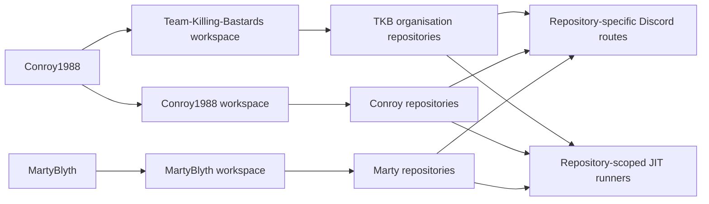

 

### Scottish roots. Community first. Build it properly. Operate it seriously.

**Gaming community · Public game tooling · Private operational platforms · Research systems · Home infrastructure · Secure automation**

[**Community**](#the-community) · [**Leadership**](#community-leadership) · [**Systems**](#organisation-systems) · [**Member portfolios**](#member-portfolios) · [**Operations**](#live-operations-board) · [**Repository index**](#complete-repository-index)

---

# The Community

**Team Killing Bastards — TKB — is a Scottish-run gaming community and technical project home.**

The community was founded and originally created by **[Conroy1988](https://github.com/Conroy1988)**. It is led by Conroy alongside **[MartyBlyth](https://github.com/Martyblyth)**, his right-hand and fellow community leader.

The organisation hosts public MissionChief tooling, private Discord infrastructure, home-operations software, market-intelligence research, portfolio governance, and shared delivery systems. Organisation hosting does **not** merge product ownership: every maintained system retains its own technical authority, data boundary, release path, credentials, and operating purpose.

<table>
<tr>
<td width="25%" align="center" valign="top">

### 🏴 SCOTTISH-RUN

**Community identity**

Built and led from Scotland with a long-term community focus.

</td>
<td width="25%" align="center" valign="top">

### ⚙️ FOUR SYSTEMS

**Product portfolio**

Four active TKB-hosted products across public and private domains.

</td>
<td width="25%" align="center" valign="top">

### 🛡️ CONTROLLED

**Trust boundaries**

Public source where appropriate; restricted operations where required.

</td>
<td width="25%" align="center" valign="top">

### ◈ MEMBER-LED

**Clear authority**

Conroy and Marty retain explicit ownership of their respective systems.

</td>
</tr>
</table>

## Operating model

| Principle | Meaning inside TKB |
|---|---|
| **Community before tooling** | Technology exists to support genuine community activity, gameplay, administration, research, or member operations. |
| **Technical ownership is explicit** | Every maintained system has a named creator, maintainer, or delivery authority. |
| **Trust domains remain separate** | Discord infrastructure, userscripts, household systems, personal repositories, and investment research do not share runtime authority. |
| **Evidence outranks assumption** | Releases, deployments, migrations, backups, routing, and recovery are verified against the resulting live state. |
| **Maintenance is product work** | Documentation, issue tracking, security, CI, recovery, and repository governance are part of delivery. |

---

# Community Leadership

<table>
<tr>
<td width="50%" valign="top">

## [Conroy1988](https://github.com/Conroy1988)

**Founder · Original owner · Community leader**

Conroy created Team Killing Bastards and retains founder and original-owner responsibility for its identity, direction, governance, and long-term stewardship.

**Organisation authority**

- Sole developer and operational owner of **TKB Discord Bot**
- Project lead and administrative authority for **Investor Matrix**
- Organisation governance, portfolio presentation, and repository standards
- GitHub integration, release infrastructure, documentation, and project support

**Independent portfolio**

- MissionChief Map Command Toolkit
- GitHub Achievement Encyclopedia
- UK Fire Command
- ConroyMedia self-hosted infrastructure
- LSSM V.4 upstream contribution work

</td>
<td width="50%" valign="top">

## [MartyBlyth](https://github.com/Martyblyth)

**Community leader · Conroy's right-hand · Project owner**

Marty leads alongside Conroy as his principal leadership partner and right-hand within the community.

**Organisation authority**

- Creator, userscript author, technical owner, and release authority for **MissionChief Command Nexus**
- Project owner and primary developer of **Blyth Control Centre**
- Development direction and release approval for his systems
- Community leadership and operational support

Marty's active first-party technical portfolio is hosted through the TKB organisation while remaining explicitly Marty-owned.

</td>
</tr>
</table>

> **Leadership and technical ownership are related but not interchangeable.** Conroy and Marty jointly lead the community while retaining separate authority over their individual software systems.

---

# Organisation Systems

## Portfolio summary

| System | Exposure | Technical authority | Current role |
|---|---:|---|---|
| **MissionChief Command Nexus** | Public | **MartyBlyth** | MissionChief UK resource administration, personnel intelligence, mission matching, and dispatch automation |
| **TKB Discord Bot** | Private | **Conroy1988** | Community automation, GitHub integration, HTTPS service management, and secured operational control |
| **Blyth Control Centre** | Private | **MartyBlyth** | Synology, Home Assistant, and household-technology command surface |
| **Investor Matrix** | Private | **Conroy1988** | Authenticated market-intelligence and portfolio decision-support foundation |

The four systems are independent products. They do not share credentials, data, deployment authority, or release ownership merely because they are hosted under Team Killing Bastards.

---

## MissionChief Command Nexus

<table>
<tr>
<td width="67%" valign="top">

### Unified operational control for MissionChief UK

**MissionChief Command Nexus** combines Marty's established Mission Finder and Unit, Station & Personnel Tools into one maintained userscript and one canonical release path.

**Current capability**

- Station, vehicle, and personnel administration
- Preview and controlled live assignment workflows
- Read-only personnel-register construction
- Exact vehicle and trained-personnel capability evidence
- Mission requirements, patient demand, and live-upgrade processing
- Unit Finder, Mission Update, and managed Auto Mode
- Complete vehicle-list loading before selection or dispatch
- Fail-closed specialist matching
- Release recovery, checksum validation, Greasy Fork parity, and repository quality gates

</td>
<td width="33%" align="center" valign="top">

### PUBLIC PRODUCT

**Creator · Userscript developer · Technical owner**  
[**MartyBlyth**](https://github.com/Martyblyth)

**Repository and documentation helper**  
[Conroy1988](https://github.com/Conroy1988)

[**⬇ Install from Greasy Fork**](https://greasyfork.org/en/scripts/587702-missionchief-command-nexus)

[Repository](https://github.com/Team-Killing-Bastards/MissionChief-Command-Nexus) · [Releases](https://github.com/Team-Killing-Bastards/MissionChief-Command-Nexus/releases/latest) · [Issues](https://github.com/Team-Killing-Bastards/MissionChief-Command-Nexus/issues)

</td>
</tr>
</table>

---

## TKB Discord Bot

<table>
<tr>
<td width="67%" valign="top">

### Private community and development operations platform

The **TKB Discord Bot** is the operational backbone of the TKB Discord and repository environment. It combines a Discord runtime, secure Control Centre, transactional state, a restricted host-operations plane, an HTTPS Gateway, and a multi-owner GitHub Integration Hub.

**Current capability**

- Discord commands, events, scheduling, countdowns, messaging, and community automation
- Levels, gamification, achievements, starboard, Battlefield, Marty, AI, and Giphy modules
- Auditable moderation cases and administrative history
- FastAPI **Control Centre 2.0** with signed sessions and CSRF-protected writes
- Transactional SQLite state, encrypted credentials, migration evidence, and integrity verification
- Registry-driven Caddy HTTPS Gateway with validation, adoption, deployment, rollback, and recovery
- Controlled backups, updates, restores, automatic rollback, and immutable operational evidence
- GitHub App workspaces for `Team-Killing-Bastards`, `Conroy1988`, and `MartyBlyth`
- Owner-scoped repository discovery, signed webhooks, durable Discord routing, isolated JIT runners, workflow evidence, recovery, and typed production sign-off
- Linux, Windows, Docker, Caddy, browser, and runtime validation gates

</td>
<td width="33%" align="center" valign="top">

### PRIVATE OPERATIONAL PLATFORM

**Sole developer · Maintainer · Operational authority**  
[**Conroy1988**](https://github.com/Conroy1988)

[**🔒 Open private repository**](https://github.com/Team-Killing-Bastards/TKB-Discord-Bot)

Accessible only to authorised organisation members and collaborators.

</td>
</tr>
</table>

---

## Blyth Control Centre

<table>
<tr>
<td width="67%" valign="top">

### Private command surface for the Blyth home technology estate

**Blyth Control Centre** is a self-hosted executive dashboard above Home Assistant and the native administration interfaces used across Marty's household technology estate.

**Current operational foundation**

- Node.js 22 and Express 5 application
- Server-side Home Assistant REST adapter and token isolation
- Synology CPU, memory, temperature, uptime, security, throughput, and storage telemetry
- Normalised health and overview APIs
- Responsive desktop, tablet, and mobile command-centre interface
- Thirty-second automatic refresh with explicit operational states
- Hardened non-root container and GHCR publication
- Synology Docker Compose deployment on port `3080`
- Reserved modular surfaces for Emby, Radarr, Sonarr, NZBGet, cameras, and Bambu printers

The media, camera, and printer panels remain clearly classified as integration foundations until their live adapters are implemented.

</td>
<td width="33%" align="center" valign="top">

### PRIVATE HOME INFRASTRUCTURE

**Project owner · Primary developer**  
[**MartyBlyth**](https://github.com/Martyblyth)

[**🔒 Open private repository**](https://github.com/Team-Killing-Bastards/blyth-control-centre)

A distinct private household system, not shared TKB community infrastructure.

</td>
</tr>
</table>

---

## Investor Matrix

<table>
<tr>
<td width="67%" valign="top">

### Self-hosted market intelligence and portfolio decision-support platform

**Investor Matrix** is a private platform being built to consolidate market data, positions, risk controls, strategy evidence, and explainable opportunity analysis behind one authenticated command centre.

**Current Phase 0 foundation**

- FastAPI application API and Next.js dashboard
- PostgreSQL-backed users, sessions, and append-only audit events
- Independent Admin and Member accounts
- Argon2 password hashing, HTTP-only sessions, CSRF protection, throttling, and temporary lockout
- Self-service password changes and cross-session revocation
- Admin session inventory, forced revocation, and filtered audit history
- Versioned Alembic migrations with fail-closed readiness checks
- PostgreSQL custom-archive backup, checksum manifest, transactional restore, and recovery documentation
- Admin-only GitHub update checking and controlled Docker deployment
- Isolated updater controller and worker with no public host port
- PostgreSQL, Redis, container health, CI, and operational telemetry

Market ingestion, portfolio accounting, analytics, strategy validation, and signals remain intentionally gated behind later delivery phases.

> Investor Matrix is analytical software. It cannot eliminate risk, guarantee returns, or replace professional financial advice.

</td>
<td width="33%" align="center" valign="top">

### PRIVATE RESEARCH &amp; DEVELOPMENT

**Project lead · Administrative authority**  
[**Conroy1988**](https://github.com/Conroy1988)

[**🔒 Open private repository**](https://github.com/Team-Killing-Bastards/Investor-Matrix)

</td>
</tr>
</table>

---

# GitHub Integration Model

The TKB Discord Bot contains a private GitHub Integration Hub designed around **separate owner domains**, not one shared super-account.

## Boundary rules

- Each owner controls their own connector, repositories, routing, runner pools, workflow policies, evidence, and acceptance records.
- GitHub App installation ownership is verified before repository discovery or token creation.
- Repositories outside the selected owner namespace are rejected.
- Discord destinations are repository-specific.
- Runner pools are scoped by owner, repository, trust class, operating system, and architecture.
- Fork-originated or untrusted work is excluded from privileged pools.
- Secrets, tokens, JIT configuration, raw webhook payloads, logs, and artefacts are never exposed as dashboard data.

This integration supports the organisation and its members without collapsing their independent ownership or security boundaries.

---

# Member Portfolios

## Conroy1988

Conroy's work spans public products, private systems, organisation infrastructure, self-hosted operations, and upstream contribution.

### Public products

| Project | Purpose | Access |
|---|---|---|
| [**MissionChief Map Command Toolkit**](https://github.com/Conroy1988/missionchief-toolkit-assets) | Configurable MissionChief map operations console covering live mission intelligence, fleet identity, coverage, navigation, finance, payouts, and responsive interface systems | [Repository](https://github.com/Conroy1988/missionchief-toolkit-assets) · [Documentation](https://conroy1988.github.io/missionchief-toolkit-assets/) · [Install](https://update.greasyfork.org/scripts/586018/MissionChief%20Map%20Command%20Toolkit.user.js) |
| [**GitHub Achievement Encyclopedia**](https://github.com/Conroy1988/Achievements) | Evidence-led research platform for active and retired GitHub achievements with confidence classifications, verification timelines, Pages, and a static API | [Repository](https://github.com/Conroy1988/Achievements) · [Encyclopedia](https://conroy1988.github.io/Achievements/) |

### Private and operational systems

| Project | Conroy's role | Current scope |
|---|---|---|
| [**TKB Discord Bot**](https://github.com/Team-Killing-Bastards/TKB-Discord-Bot) | Sole developer and operational authority | Discord, Control Centre, GitHub Hub, Gateway, deployment, recovery, and community infrastructure |
| [**Investor Matrix**](https://github.com/Team-Killing-Bastards/Investor-Matrix) | Project lead and Admin authority | Authenticated Phase 0 market-intelligence platform foundation |
| [**UK Fire Command**](https://github.com/Conroy1988/uk-fire-command) | Creator and technical owner | Persistent map-first UK Fire and Rescue management game |
| **ConroyMedia** | Operator and infrastructure owner | Docker services, Caddy, DDNS, networking, monitoring, backup, deployment, and recovery |

### Upstream contribution

Conroy's current upstream contribution adds optional monospaced note editing and preview support across ten supported LSSM locale files. The pull request remains open and belongs to the upstream LSSM review process.

[**Open Conroy1988's complete GitHub profile**](https://github.com/Conroy1988)

## MartyBlyth

Marty's current first-party systems are hosted under the TKB organisation:

| Project | Role | Current scope |
|---|---|---|
| [**MissionChief Command Nexus**](https://github.com/Team-Killing-Bastards/MissionChief-Command-Nexus) | Creator, userscript author, technical owner, and release authority | MissionChief UK administration, trained-personnel intelligence, requirement matching, and dispatch automation |
| [**Blyth Control Centre**](https://github.com/Team-Killing-Bastards/blyth-control-centre) | Project owner and primary developer | Private Home Assistant, Synology, and household-operations command surface |

[**Open MartyBlyth's GitHub profile**](https://github.com/Martyblyth)

---

# Live Operations Board

## Public systems

| System | Release / publication | Activity | Work queue / validation |
|---|---|---|---|
| **Command Nexus** |   |  |   |
| **Map Command Toolkit** |   |  |   |
| **Achievement Encyclopedia** |   |  |   |
| **TKB organisation profile** |  |  | Organisation governance and portfolio presentation |

## Private systems

| System | Current posture | Authority |
|---|---|---|
| **TKB Discord Bot** |    | Conroy1988 — sole technical and operational authority |
| **Blyth Control Centre** |    | MartyBlyth — project owner and primary developer |
| **Investor Matrix** |    | Conroy1988 — project lead and Admin authority |
| **UK Fire Command** |    | Conroy1988 — creator and technical owner |

---

# Complete Repository Index

## Team Killing Bastards organisation

| Repository | Visibility | Classification | Authority / purpose |
|---|---:|---|---|
| [**MissionChief-Command-Nexus**](https://github.com/Team-Killing-Bastards/MissionChief-Command-Nexus) | Public | Product | MartyBlyth technical owner; public MissionChief userscript |
| [**TKB-Discord-Bot**](https://github.com/Team-Killing-Bastards/TKB-Discord-Bot) | Private | Operational platform | Conroy1988 sole technical and operational authority |
| [**blyth-control-centre**](https://github.com/Team-Killing-Bastards/blyth-control-centre) | Private | Home infrastructure | MartyBlyth project owner; private household system |
| [**Investor-Matrix**](https://github.com/Team-Killing-Bastards/Investor-Matrix) | Private | Research and development | Conroy1988 project lead; authenticated market-intelligence foundation |
| [**.github**](https://github.com/Team-Killing-Bastards/.github) | Public | Organisation governance | Public organisation profile, standards, and visual assets |
| [**demo-repository**](https://github.com/Team-Killing-Bastards/demo-repository) | Private | Internal sandbox | Deliberately excluded from the active product count |

## Conroy1988 repositories

| Repository | Visibility | Classification |
|---|---:|---|
| [**missionchief-toolkit-assets**](https://github.com/Conroy1988/missionchief-toolkit-assets) | Public | Flagship MissionChief product, releases, documentation, and distribution |
| [**Achievements**](https://github.com/Conroy1988/Achievements) | Public | GitHub Achievement Encyclopedia and research platform |
| [**uk-fire-command**](https://github.com/Conroy1988/uk-fire-command) | Private | Persistent UK emergency-service management game |
| **missionchief-map-command-toolkit-private** | Private | Toolkit support, recovery, and private release boundary |
| [**Conroy1988**](https://github.com/Conroy1988/Conroy1988) | Public | Personal GitHub portfolio and repository-owned visual assets |
| [**LSSM-V.4**](https://github.com/Conroy1988/LSSM-V.4) | Public fork | Upstream contribution workspace |
| [**RED4ext**](https://github.com/Conroy1988/RED4ext) | Public fork | Third-party fork/reference; not an original TKB product |

## Classification rules

- **Products** are maintained systems with defined users, ownership, and delivery paths.
- **Operational platforms** contain private runtime or community infrastructure.
- **Research and development** repositories may be runnable without claiming completed production capability.
- **Support repositories** contain mirrors, backups, profile assets, or release infrastructure.
- **Forks and contribution workspaces** preserve third-party ownership and are not presented as original TKB products.
- **Internal sandboxes** are excluded from product counts.

---

# Delivery and Engineering Standard

<table>
<tr>
<td width="25%" align="center" valign="top">

### ◈ SOURCE AUTHORITY

One canonical repository and trusted branch for every maintained system.

</td>
<td width="25%" align="center" valign="top">

### ✓ VERIFIED CHANGE

Review, validation, and release controls proportionate to the project.

</td>
<td width="25%" align="center" valign="top">

### ⛨ SECURITY BOUNDARY

Secrets, household data, holdings, and private operations remain outside public source.

</td>
<td width="25%" align="center" valign="top">

### ↗ TRACEABLE DELIVERY

Documented versions, deployments, evidence, ownership, and recovery paths.

</td>
</tr>
</table>

TKB-hosted and member-owned systems are expected to maintain:

- A precise purpose and clearly defined scope
- Accurate documentation aligned with the live implementation
- Explicit technical authority and supporting responsibilities
- Reproducible deployment or installation instructions
- Security controls proportionate to exposure and operational risk
- Structured issue, change, and release workflows where applicable
- Validated release artefacts and recoverable delivery processes
- Clear distinction between implemented capability and planned work
- Clear separation between unrelated products and trust domains

---

# Technical Portfolio

### Languages and interface engineering

### Applications, data, and automation

### Platforms, integration, and delivery

---

# Direct Access

| Destination | Purpose |
|---|---|
| [**Team Killing Bastards repositories**](https://github.com/orgs/Team-Killing-Bastards/repositories) | Complete organisation repository list |
| [**MissionChief Command Nexus**](https://github.com/Team-Killing-Bastards/MissionChief-Command-Nexus) | Public source, releases, and development activity |
| [**Install Command Nexus**](https://greasyfork.org/en/scripts/587702-missionchief-command-nexus) | Recommended installation and update route |
| [**TKB Discord Bot**](https://github.com/Team-Killing-Bastards/TKB-Discord-Bot) | Private community and development operations platform |
| [**Blyth Control Centre**](https://github.com/Team-Killing-Bastards/blyth-control-centre) | Private home-operations project |
| [**Investor Matrix**](https://github.com/Team-Killing-Bastards/Investor-Matrix) | Private market-intelligence research platform |
| [**Conroy1988**](https://github.com/Conroy1988) | Founder, original owner, and complete personal portfolio |
| [**MartyBlyth**](https://github.com/Martyblyth) | Community leader and Marty-owned project portfolio |

---

## Team Killing Bastards

### Scottish roots. Community first. Build it properly. Operate it seriously.

**Gaming community · Software · Automation · Research · Game systems · Private infrastructure**

Projects hosted by Team Killing Bastards remain independent from the third-party platforms they extend or reference. Product names and trademarks remain the property of their respective owners.

