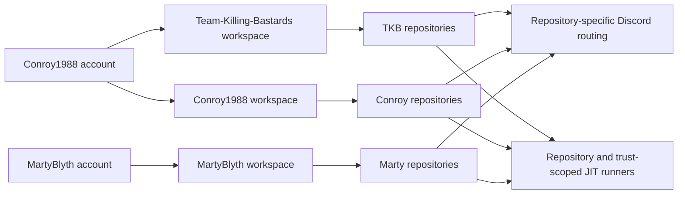

 

### Scottish roots. Community first. Build it properly. Operate it seriously.

**Gaming community · Public game tooling · Private operational platforms · Research systems · Home infrastructure · Secure automation**

[**Community**](#the-community) · [**Leadership**](#community-leadership) · [**Systems**](#organisation-systems) · [**Member portfolios**](#member-portfolios) · [**GitHub Hub**](#github-integration-model) · [**Operations**](#live-operations-board) · [**Repositories**](#complete-repository-index)

---

# The Community

**Team Killing Bastards — TKB — is a Scottish-run gaming community and technical project home.**

The community was founded and originally created by **[Conroy1988](https://github.com/Conroy1988)**. It is led by Conroy alongside **[MartyBlyth](https://github.com/Martyblyth)**, his right-hand and fellow community leader.

The organisation hosts public MissionChief tooling, private Discord infrastructure, home-operations software, market-intelligence research, portfolio governance, and shared delivery systems.

Organisation hosting does **not** merge product ownership. Every maintained system retains its own:

- creator and technical authority;
- canonical source;
- data and credential boundary;
- release and deployment path;
- operating purpose; and
- recovery responsibility.

<table>
<tr>
<td width="25%" align="center" valign="top"><strong>🏴 SCOTTISH-RUN</strong> Long-term community identity and leadership.</td>
<td width="25%" align="center" valign="top"><strong>⚙️ FOUR SYSTEMS</strong> Public products and private operational platforms.</td>
<td width="25%" align="center" valign="top"><strong>🛡️ CONTROLLED</strong> Trust boundaries proportionate to real exposure.</td>
<td width="25%" align="center" valign="top"><strong>◈ MEMBER-LED</strong> Conroy and Marty retain explicit authority over their systems.</td>
</tr>
</table>

## Operating model

| Principle | Meaning inside TKB |
|---|---|
| **Community before tooling** | Technology exists to support genuine community, gameplay, administration, research, or household operations |
| **Explicit technical authority** | Every maintained system has a named owner and release authority |
| **Separate trust domains** | Discord, userscripts, home systems, finance research, and games do not share credentials or runtime control |
| **Evidence over assumption** | Releases, deployments, backups, migrations, and recovery are verified against the resulting state |
| **Maintenance is product work** | Documentation, issues, security, compatibility, and recovery are part of delivery |

---

# Community Leadership

<table>
<tr>
<td width="50%" valign="top">

## [Conroy1988](https://github.com/Conroy1988)

**Founder · Original owner · Community leader**

Conroy created Team Killing Bastards and retains founder and original-owner responsibility for its identity, direction, governance, and long-term stewardship.

**Technical authority**

- Sole developer and operational owner of **TKB Discord Bot**
- Project lead and Admin authority for **Investor Matrix**
- Creator and release authority for **MissionChief Map Command Toolkit**
- Creator and research owner of **GitHub Achievement Encyclopedia**
- Creator and architecture owner of **UK Fire Command**
- Organisation governance, repository infrastructure, and delivery support

</td>
<td width="50%" valign="top">

## [MartyBlyth](https://github.com/Martyblyth)

**Community leader · Conroy's right-hand · Project owner**

Marty leads alongside Conroy as his principal leadership partner and right-hand within the community.

**Technical authority**

- Creator, userscript author, and release authority for **MissionChief Command Nexus**
- Creator, owner, and primary developer of **Blyth Control Centre**
- Development direction and production approval for his systems
- Community leadership and operational support

</td>
</tr>
</table>

> **Community leadership is shared. Technical ownership remains explicit.** Repository support, documentation assistance, or organisation hosting does not transfer creator authority.

---

# Organisation Systems

## MissionChief Command Nexus

<table>
<tr>
<td width="67%" valign="top">

### Unified MissionChief UK resource preparation and dispatch

**Current production version: `1.0.14` · Mission Finder engine: `V10.6.80`**

Command Nexus combines Marty's Mission Finder and Unit, Station & Personnel Tools into one maintained userscript.

**Current capability**

- Station and vehicle naming
- Preview and Live personnel assignment
- Read-only vehicle/personnel training-register construction
- Complete vehicle-list loading
- Live Mission Requirements as current selection authority
- Still Needed / Required reconciliation
- Exact trained specialist-vehicle matching
- Unit Finder, Mission Update, upgrades, Auto Mode, and continuation
- Verified release, Greasy Fork parity, checksums, and Discord publication

</td>
<td width="33%" align="center" valign="top">

### PUBLIC PRODUCT

**Creator · Technical owner · Release authority**  
[**MartyBlyth**](https://github.com/Martyblyth)

**Repository and documentation support**  
[Conroy1988](https://github.com/Conroy1988)

[**⬇ Install from Greasy Fork**](https://greasyfork.org/en/scripts/587702-missionchief-command-nexus)

</td>
</tr>
</table>

## TKB Discord Bot

<table>
<tr>
<td width="67%" valign="top">

### Private Discord, GitHub, deployment, and gateway operations platform

The TKB Discord Bot is the operational backbone of the community environment.

**Current capability**

- Discord commands, events, scheduling, levels, gamification, starboard, Battlefield, AI, and Giphy
- Moderation logging and immutable case management
- FastAPI **Control Centre 2.0**
- Transactional SQLite state and encrypted credentials
- Managed Caddy HTTPS Gateway with validation, adoption, rollback, reconcile, and abandon workflows
- Backup, update, restore, rollback, and host-agent evidence
- Multi-owner **GitHub Integration Hub**
- GitHub App repository discovery and signed webhooks
- Repository-specific Discord routing with retries and dead letters
- Isolated repository-scoped JIT runners and workflow evidence
- Controlled retry/reconcile operations and audited production sign-off

</td>
<td width="33%" align="center" valign="top">

### PRIVATE OPERATIONAL PLATFORM

**Sole developer · Maintainer · Operational authority**  
[**Conroy1988**](https://github.com/Conroy1988)

[**🔒 Open private repository**](https://github.com/Team-Killing-Bastards/TKB-Discord-Bot)

</td>
</tr>
</table>

## Blyth Control Centre

<table>
<tr>
<td width="67%" valign="top">

### Private home-technology executive command surface

**Current version: `0.4.0`**

Blyth Control Centre consolidates the Blyth household technology estate into one responsive operational dashboard.

**Implemented capability**

- Home Assistant and Synology NAS telemetry
- CPU, memory, temperature, uptime, security, throughput, and volume state
- Emby runtime and activity context
- Radarr and Sonarr API integration
- NZBGet JSON-RPC queue and history presentation
- External identity/access protection with explicit logout control
- Concurrent service reads and isolated degradation states
- Hardened Synology Docker deployment and GHCR publication

**Planned foundations**

- Secure camera mediation
- Bambu P1S/H2D telemetry
- Deeper container and recovery operations

</td>
<td width="33%" align="center" valign="top">

### PRIVATE HOME INFRASTRUCTURE

**Project owner · Primary developer**  
[**MartyBlyth**](https://github.com/Martyblyth)

[**🔒 Open private repository**](https://github.com/Team-Killing-Bastards/blyth-control-centre)

</td>
</tr>
</table>

## Investor Matrix

<table>
<tr>
<td width="67%" valign="top">

### Private market-intelligence and risk-control platform

**Current state: Phase 0 — authenticated, recoverable Docker foundation**

**Implemented capability**

- Next.js command centre and FastAPI API
- PostgreSQL users, sessions, audit events, and Alembic migrations
- Admin and Member account boundaries
- Argon2 authentication, CSRF, throttling, and lockout
- Password changes, active-session control, and audit filters
- Redis and dependency readiness
- Admin-only fast-forward GitHub updater
- PostgreSQL backup, SHA-256 manifests, transactional restore, and recovery drills

Market ingestion, portfolio accounting, risk analytics, backtesting, and explainable signals remain gated behind later phases.

</td>
<td width="33%" align="center" valign="top">

### PRIVATE RESEARCH & DEVELOPMENT

**Project lead · Admin authority**  
[**Conroy1988**](https://github.com/Conroy1988)

[**🔒 Open private repository**](https://github.com/Team-Killing-Bastards/Investor-Matrix)

</td>
</tr>
</table>

> [!IMPORTANT]
> These four systems are independent products. They do not share runtime, credentials, household data, financial data, deployment authority, or release ownership merely because they are hosted under TKB.

---

# Member Portfolios

## Conroy1988

### MissionChief Map Command Toolkit

**Current verified release: `v4.20.24`**

A public MissionChief map operations suite covering mission intelligence, live requirement reconciliation, specialist fleet identity, geographic coverage, transport workflows, finance, payouts, and seven complete interface systems.

The current release reconciles Financial Advisor detailed transactions against MissionChief `/credits/overview` daily Revenue, Spendings, and Sum checkpoints without double counting, while preserving variance and partial-period behaviour.

[Repository](https://github.com/Conroy1988/missionchief-toolkit-assets) · [Documentation](https://conroy1988.github.io/missionchief-toolkit-assets/) · [Install](https://update.greasyfork.org/scripts/586018/MissionChief%20Map%20Command%20Toolkit.user.js)

### GitHub Achievement Encyclopedia

**Formal release: `v1.4.0` · Active research campaign: `v1.5.0` · Health: 100/100**

An evidence-led public reference platform for active and retired GitHub profile achievements, with confidence classifications, verification timelines, official-document monitoring, a campaign-classified research queue, a searchable Pages site, and a static API.

[Repository](https://github.com/Conroy1988/Achievements) · [Encyclopedia](https://conroy1988.github.io/Achievements/) · [Research](https://github.com/Conroy1988/Achievements/blob/main/docs/research-hub.md)

### UK Fire Command

A private, persistent, map-first UK Fire and Rescue management game with Scotland and England operating regions, station development, appliance purchasing, qualified crews, time-patterned incident demand, real-road routing, escalation, immutable credit transactions, and fleet maintenance.

[**🔒 Open private repository**](https://github.com/Conroy1988/uk-fire-command)

## MartyBlyth

Marty's current first-party systems are hosted under TKB:

| Project | Authority | Current scope |
|---|---|---|
| [MissionChief Command Nexus](https://github.com/Team-Killing-Bastards/MissionChief-Command-Nexus) | Creator, userscript author, technical owner, release authority | MissionChief UK resource administration, live demand, trained-personnel matching, and dispatch |
| [Blyth Control Centre](https://github.com/Team-Killing-Bastards/blyth-control-centre) | Creator, project owner, primary developer | Home Assistant, Synology, Emby, Radarr, Sonarr, NZBGet, and household command operations |

[Open MartyBlyth's profile](https://github.com/Martyblyth)

---

# GitHub Integration Model

The private TKB Discord Bot contains a GitHub Integration Hub with three separate owner workspaces:

The Hub provides:

- owner-scoped GitHub App connectors;
- encrypted webhook secrets and private keys;
- bounded repository discovery and explicit onboarding;
- HMAC verification and replay suppression;
- sanitised Discord event cards;
- retries, dead letters, retry, and abandon controls;
- Linux and Windows repository-scoped JIT runner pools;
- workflow-run and workflow-job evidence;
- allowlisted workflow recovery; and
- per-workspace production verification and typed audited sign-off.

No workspace is assigned automatically. Dan and Marty retain separate dashboard identities and permissions.

---

# Live Operations Board

## Public systems

| System | Release | Activity | Work queue |
|---|---|---|---|
| **Command Nexus** |  |  |  |
| **Map Command Toolkit** |  |  |  |
| **Achievement Encyclopedia** |  |  |  |

## Private systems

| System | Current posture | Authority |
|---|---|---|
| **TKB Discord Bot** | Operational · Control Centre 2.0 · GitHub Hub · HTTPS Gateway | Conroy1988 |
| **Blyth Control Centre** | v0.4.0 · NAS and four media-service integrations | MartyBlyth |
| **Investor Matrix** | Phase 0 · Authenticated and recoverable foundation | Conroy1988 |
| **UK Fire Command** | Active development · Persistent Scotland/England command loop | Conroy1988 |

## Open-source contribution

Conroy's current upstream LSSM contribution adds optional monospaced note editing and preview support across supported locales. The upstream project and its maintainers retain full ownership and review authority.

---

# Complete Repository Index

| Repository | Visibility | Classification | Authority / purpose |
|---|---:|---|---|
| [MissionChief-Command-Nexus](https://github.com/Team-Killing-Bastards/MissionChief-Command-Nexus) | Public | Product | MartyBlyth technical owner; MissionChief userscript |
| [TKB-Discord-Bot](https://github.com/Team-Killing-Bastards/TKB-Discord-Bot) | Private | Operational platform | Conroy1988 sole technical and operational authority |
| [blyth-control-centre](https://github.com/Team-Killing-Bastards/blyth-control-centre) | Private | Home infrastructure | MartyBlyth project owner and primary developer |
| [Investor-Matrix](https://github.com/Team-Killing-Bastards/Investor-Matrix) | Private | Research and development | Conroy1988 project lead and Admin authority |
| [.github](https://github.com/Team-Killing-Bastards/.github) | Public | Governance | Organisation profile and visual assets |
| [demo-repository](https://github.com/Team-Killing-Bastards/demo-repository) | Private | Internal sandbox | Disposable GitHub feature testing; not a product |

## Classification rules

- Products have defined users, ownership, scope, and delivery paths.
- Operational platforms contain private runtime or community infrastructure.
- Research repositories distinguish implemented foundations from planned capability.
- Support repositories contain profiles, recovery material, or delivery infrastructure.
- Forks and upstream work retain third-party ownership.
- Sandboxes are excluded from active product counts.

---

# Delivery and Engineering Standard

TKB-hosted systems are expected to maintain:

- a canonical repository and trusted branch;
- accurate documentation aligned with live implementation;
- explicit technical ownership and supporting roles;
- reproducible installation or deployment;
- security controls proportionate to exposure;
- structured issue and release workflows where applicable;
- validated assets and recoverable delivery;
- clear separation between implemented and planned capability; and
- separate data, credential, and runtime trust domains.

### Languages and application engineering

### Applications, data, and delivery

---

## Team Killing Bastards

### Scottish roots. Community first. Build it properly. Operate it seriously.

**Gaming community · Software · Automation · Research · Game systems · Private infrastructure**

[Repositories](https://github.com/orgs/Team-Killing-Bastards/repositories) · [Conroy1988](https://github.com/Conroy1988) · [MartyBlyth](https://github.com/Martyblyth)

Projects hosted by Team Killing Bastards remain independent from the third-party platforms they extend or reference. Product names and trademarks remain the property of their respective owners.

